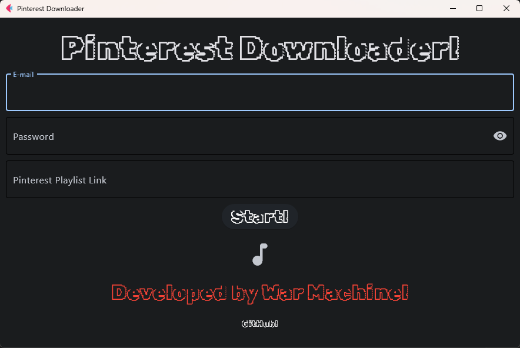

<h1>Pinterest Downloader</h1>

  

<h2>Installation: </h2>

<h3>On Windows: </h3>

Execute the pinterestdownloader_setup.exe

<h3>On Linux: </h3>

pip install -r requeriments.txt

python PinterestDownloader.py

