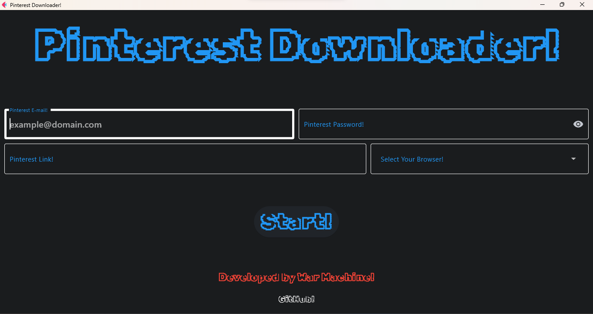

<h1 align="center">Pinterest Downloader</h1>

  

<h2 align="center">Installation: </h2>

<h3 align="center">On Windows: </h3>

<h4 align="center">Option 1: </h4>

Install Requeriments: pip install -r requeriments.txt

Execute: python PinterestDownloader.py

<h4 align="center">Option 2: </h4>

Extract the File: PinterestDownloader.zip

Execute: PinterestDownloader.exe

<h4 align="center">Option 3: </h4>

Install With: PinterestDownloaderSetup.exe

<h3 align="center">On Linux: </h3>

Install Requeriments: pip install -r requeriments.txt

Execute: python PinterestDownloader.py
